# Challenge Amigo Secreto

En este desafío nos proporcionan los archivos **HTML y CSS**. Por lo cual nos vamos a centrar en  aplicar lo aprendido en **JS**. Aplicando conceptos claves como **Funciones, arrays, condiciones, etc**.
con la finalidad de **desarrollar una aplicación** que nos permita listar a nuestros amigos y obtener un Ganador al azar quien sera nuestro **Amigo Secreto**.

## Demo

Insert gif or link to demo

## Screenshots

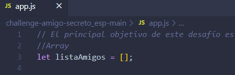

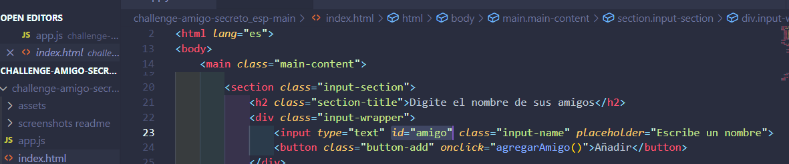

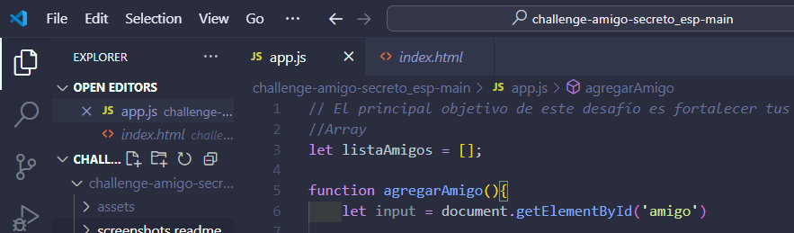

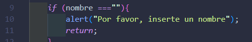

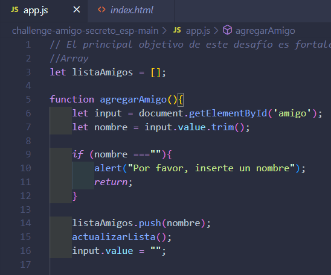

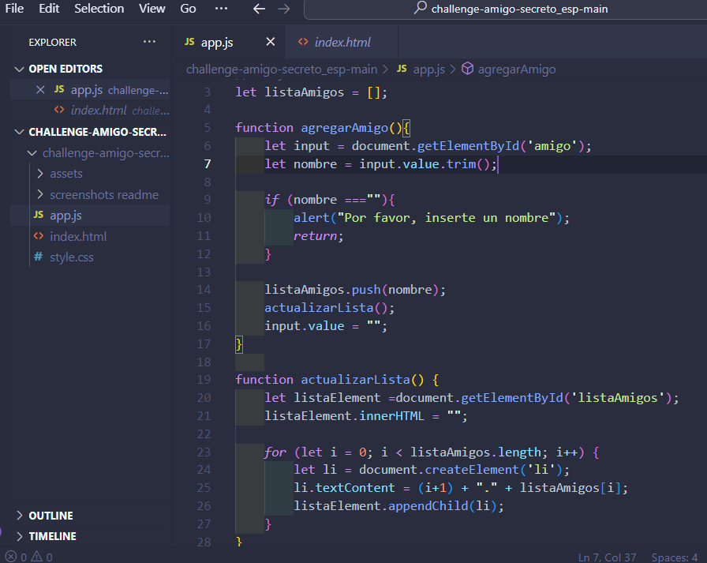

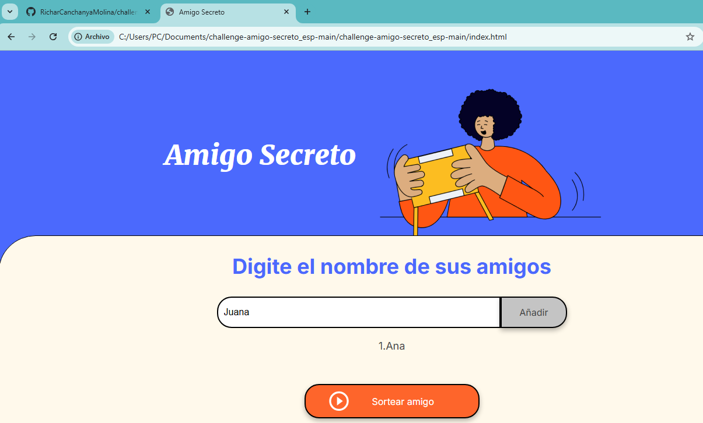

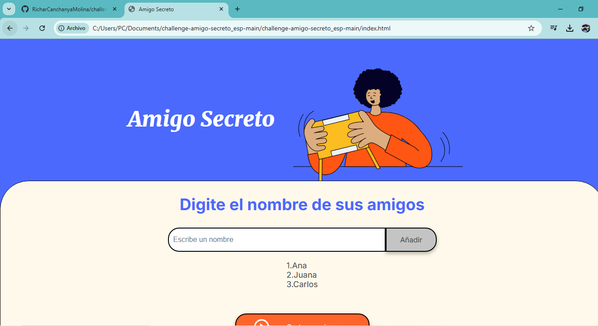

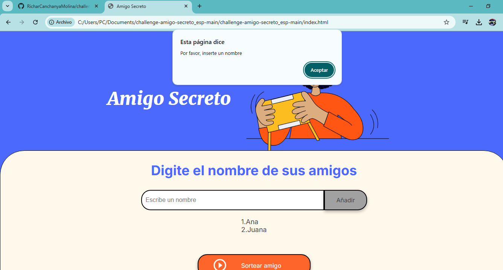

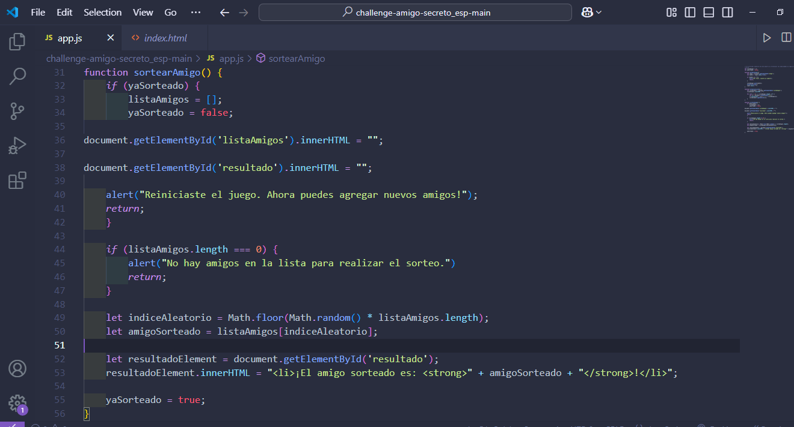

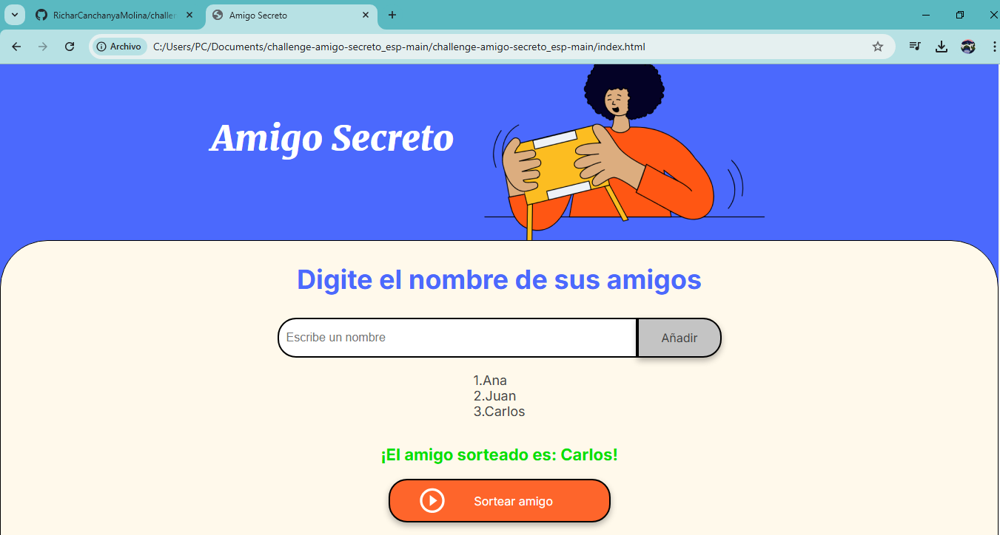

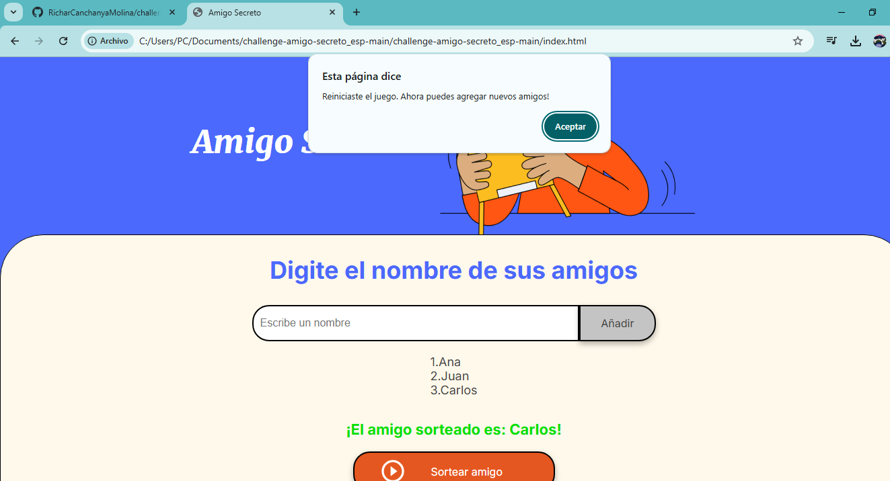

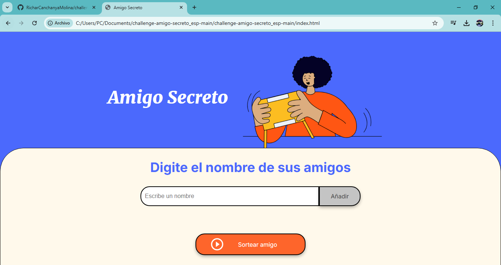

## Tareas específicas

 
- **Capturar el valor del campo de entrada:** Utilizar document.getElementById o document.querySelector para obtener el texto ingresado por el usuario.

- **Validar la entrada:** Implementar una validación para asegurarse de que el campo no esté vacío. Si está vacío, mostrar un alert con un mensaje de error: "Por favor, inserte un nombre."

- **Actualizar el array de amigos:** Si el valor es válido, añadirlo al arreglo que almacena los nombre de amigos usando el método.push().

- **Limpiar el campo de entrada:** Después de añadir el nombre, restablecer el campo de texto a una cadena vacía.

- **Obtener el elemento de la lista:** Utilizar document.getElementById() o document.querySelector() para seleccionar la lista donde se mostrarán los amigos.
- **Limpiar la lista existente:** Establecer lista.innerHTML = "" para asegurarse de que no haya duplicados al actualizar.

- **Iterar sobre el arreglo:** Usa un bucle for para recorrer el arreglo amigos y crear elementos de lista (<li>) para cada título.

- **Agregar elementos a la lista:** Para cada amigo, crear un nuevo elemento de lista.

- **Validar que haya amigos disponibles:** Antes de sortear, comprobar si el array amigos no está vacío.

- **Generar un índice aleatorio:** Usar Math.random() y Math.floor() para seleccionar un índice aleatorio del arreglo.

- **Obtener el nombre sorteado:** Utilizar el índice aleatorio para acceder al nombre correspondiente en el arreglo.

- **Mostrar el resultado:** Actualizar el contenido del elemento de resultado utilizando document.getElementById()  e innerHTML para mostrar el amigo sorteado.

## Tech Stack

**Frontend:** HTML, CSS y Javascript

